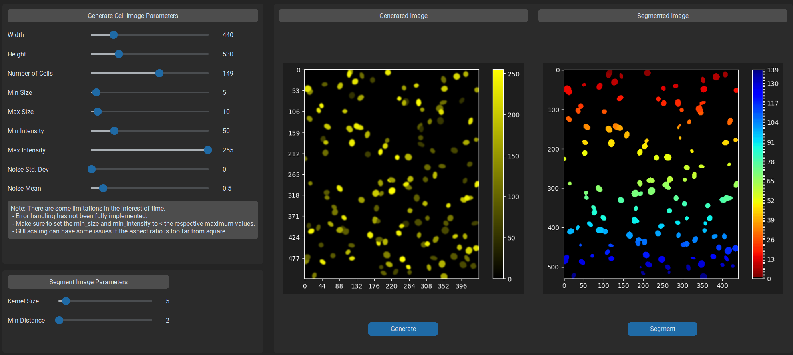

# Synthetic Cell Image Generation and Segmentation

This project provides a graphical user interface (GUI) to generate and segment images of cells. It uses custom sliders to control various parameters of the generated images and applies segmentation techniques to identify individual cells.



## Features

- Generate cell images with adjustable parameters like size, intensity, and noise.
- Apply segmentation to recognize individual cells.
- Customize appearance through sliders and controls.
- Dark mode theme for GUI.

## Installation

### Option 1: Download the Executable (Windows)

1. Download the latest executable from the [Releases](https://github.com/anishzute/synthetic-cell-segmentation/releases) page.
2. Unzip the downloaded file.
3. Run `synthetic_cell_segmentation.exe` to launch the application.

### Option 2: Build from Python Source

#### Prerequisites

- Python 3.x
- PIL (Pillow)
- NumPy
- OpenCV
- scikit-image
- matplotlib
- customtkinter
- tkinter

#### Install Dependencies

1. Clone the repository:

   ```bash
   git clone https://github.com/yourusername/synthetic-cell-segmentation.git
   ```

2. Navigate to the project directory:

   ```bash
   cd synthetic_cell_segmentation
   ```

3. Install the required packages:

   ```bash
   pip install -r requirements.txt
   ```

## Usage

Simply double-click on `synthetic-cell-segmentation.exe` to launch the application. You may need to click

Run the main script to launch the GUI:

```bash
python src/main.py
```

Use the sliders and buttons in the GUI to generate and segment cell images according to your preferences.

## Thoughts and Improvements

I see several avenues for improvement and expansion. One significant enhancement would be to integrate a Convolutional Neural Network (CNN) to perform cell segmentation or classification. Training a CNN would allow for more accurate and automated identification of cell structures, potentially improving both the speed and precision of the process. I could also work on optimizing the existing code, perhaps by refactoring some functions for better modularity or introducing parallel processing for more efficient execution. Adding a user-friendly GUI with more customization options for researchers or medical professionals might enhance the tool's usability. I would also add the ability to batch generate images and save them to files. Additionally, incorporating data analytics and visualization tools would provide insightful metrics and trends related to the cell data. By investing time in these improvements, I believe the project could evolve into a more comprehensive and powerful tool for cell image analysis.


## Contributing

Contributions are welcome! Please feel free to submit issues and pull requests.

## License

This project is licensed under the MIT License - see the [LICENSE](LICENSE) file for details.

## Acknowledgments

This project was created as a test for the St-Pierre Lab at the Baylor College of Medicine
